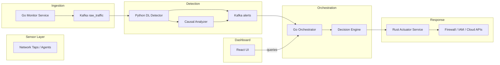

**Autonomous Cybersecurity Incident Response System**

---

## 1. Project Overview

Build a fully autonomous AI-driven platform that detects, investigates, and mitigates cyber threats in real-time with zero human intervention. It comprises three core subsystems:

* **Threat Detection & Forensics (Python/DL)**
* **Network Monitoring & Orchestration (Go)**
* **Automated Response & Hardening (Rust)**

---

## 2. High-Level Roadmap & Timeline

| Phase                                                            | Duration | Key Deliverables                                               |
| ---------------------------------------------------------------- | -------- | -------------------------------------------------------------- |
| **1. Requirements & Research**                                   | 1 month  | Threat models, data sources, success metrics                   |
| **2. Architectural Design**                                      | 1 month  | Detailed component diagrams, API contracts                     |
| **3. Prototype PoC**                                             | 2 months | Python detector prototype; Go monitor stub; Rust actuator stub |
| **4. MVP Development**                                           | 4 months | Integrated pipeline; basic DL model; SOAR integration          |
| **5. Testing & Validation**                                      | 2 months | Adversarial test suite; red-team exercises                     |
| **6. Beta Release & Hardening**                                  | 2 months | Performance tuning; containerization; security audit           |
| **7. Production Deployment**                                     | 2 months | Auto-scaling, multi-tenant support, documentation              |
| **Total Time to MVP:** 10 months (MVP) / 15–20 months (Full)\*\* |          |                                                                |

---

## 3. Detailed Phase Tasks

### Phase 1: Requirements & Research

1. **Threat Landscape Analysis**

   * Enumerate attack vectors (DoS, ransomware, APT).
   * Define detection KPIs (precision ≥ 95%, latency ≤ 1 s).
2. **Data Acquisition**

   * Collect real-world labeled traffic (Zeek logs, PCAPs).
   * Subscribe to threat intel feeds (AlienVault OTX).
3. **Success Metrics**

   * Mean time to detect (MTTD) ≤ 5 s.
   * Mean time to contain (MTTC) ≤ 10 s.

### Phase 2: Architectural Design

1. **Component Diagram**

   * Draw interactions: sensor → detector → orchestrator → actuator.
2. **API Contracts**

   * gRPC definitions for inter-service communication.
3. **Data Schema**

   * Kafka topics: `raw_traffic`, `alerts`, `actions`.

### Phase 3: Prototype PoC

1. **Python Detector**

   * Implement CNN/LSTM ensemble in PyTorch.
   * Ingest pre-recorded PCAPs via Scapy.
2. **Go Monitor**

   * Simple packet sniffer using `gopacket`.
   * Push to Kafka.
3. **Rust Actuator**

   * Stub that receives action commands, writes to firewall via `nftables` binding.
4. **Integration Test**

   * Simulate simple port-scan; verify end-to-end flow.

### Phase 4: MVP Development

1. **Advanced Detection**

   * Implement adversarial training with CleverHans.
   * Add causal model component using DoWhy.
2. **Multi-Agent Coordination**

   * Each agent monitors different segments; coordinate via Redis.
3. **SOAR Integration**

   * Build connector to Cortex XSOAR.
4. **User Interface**

   * Minimal dashboard in React showing alerts & actions.

### Phase 5: Testing & Validation

1. **Adversarial Testing**

   * Generate evasive malware samples; test detection recall.
2. **Red-Team Exercises**

   * Conduct live attack drills; measure MTTD/MTTC.
3. **Security Audit**

   * Static analysis (Rust Clippy, Go Vet), dependency scans.

### Phase 6: Beta Release & Hardening

1. **Containerization**

   * Dockerize each service; define Helm charts.
2. **Performance Tuning**

   * Benchmark via Locust; tune batch sizes, concurrency.
3. **High Availability**

   * Deploy on Kubernetes with replicas and health probes.

### Phase 7: Production Deployment

1. **Auto-Scaling**

   * Use HPA on Kubernetes based on CPU/pending messages.
2. **Multi-Tenant Support**

   * Isolate data via separate Kafka topics and namespaces.
3. **Operational Documentation**

   * Runbooks for incident response, on-call procedures.

---

## 4. Technical Architecture Diagram



---

## 5. Proposed Repository Structure

```
autocidr/
├── sensor/
│   └── go-monitor/                # Go packet capture & ingestion
│       ├── cmd/
│       ├── pkg/
│       └── go.mod
├── detection/
│   └── python-detector/           # DL models & forensic analysis
│       ├── src/
│       │   ├── models/
│       │   ├── data_pipeline.py
│       │   └── train.py
│       ├── requirements.txt
│       └── dockerfile
├── orchestration/
│   └── go-orchestrator/           # Alert handling & decision logic
│       ├── internal/
│       ├── api/
│       └── go.mod
├── response/
│   └── rust-actuator/             # Secure response automation
│       ├── src/
│       └── Cargo.toml
├── common/
│   ├── proto/                     # gRPC .proto definitions
│   └── kafka/                     # shared Kafka schemas
├── infra/
│   ├── k8s/                       # Helm charts, manifests
│   └── terraform/                 # Cloud infra as code
├── ui/
│   └── dashboard/                 # React/TypeScript front end
├── tests/
│   ├── integration/
│   └── adversarial/
├── docs/
│   ├── architecture.md
│   └── runbooks/
└── .gitignore
```

---

## 6. Team & Roles

* **Data Scientists (2)**: build & validate DL/causal models.
* **Go Engineers (2)**: sensor & orchestrator services.
* **Rust Engineers (1)**: secure actuator implementation.
* **DevOps (1)**: CI/CD pipelines, Kubernetes, Terraform.
* **Security Analysts (1–2)**: threat research, red-team.

---

This plan yields an integrated, autonomous incident response platform ready for enterprise deployment within 15–20 months, leveraging Python, Go, and Rust for optimal performance, security, and scalability.
